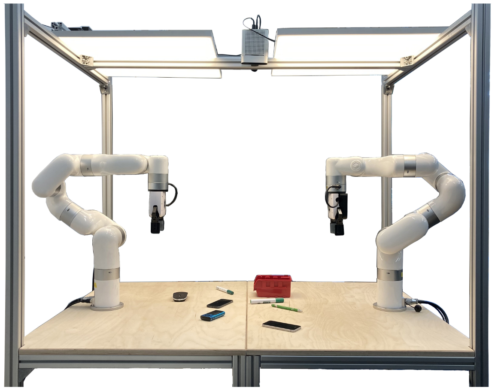

# LeRobot implemenation for Dual xArm 7

This Repository implements two **uFactory xArm7** to [LeRobot](https://github.com/huggingface/lerobot).

---
## The Setup
The setup looks like this:

---
## Hardware

- 3-4 Intel Realsense D405
    - Top View
    - Wrist Cameras for each Robot
    - optional: Wurm-Eye Camera

